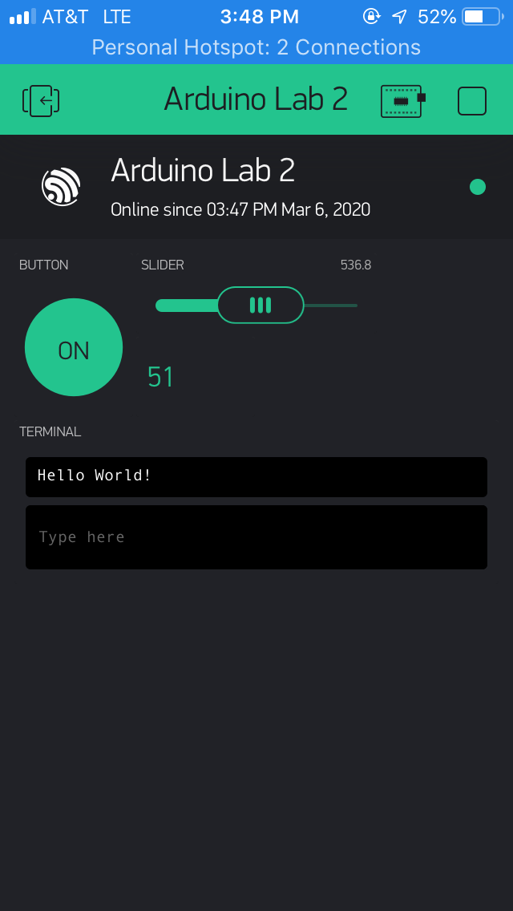

Name: Johanna McCormack

EID: jrm7853

Team Number: F1

## Questions

1. What is the purpose of an IP address?

    An IP address allows one device to identify another by its unique address.

2. What is a DNS? What are the benefits of using domain names instead of IP addresses?

    A DNS is a Domain Name Service, which maps to an IP address. Because IP addresses are just a collection of numbers, it's incredibly difficult to remember IP addresses. A DNS makes it more user-friendly/easier to remember.

3. What is the difference between a static IP and a dynamic IP?

    If a device has a static IP, the address won't change. If it's dynamic, it's assigned when it connects to the network

4. What is the tradeoff between UDP and TCP protocols?

    UDP is much faster than TCP but much less reliable.

5. Why can't we use the delay function with Blynk?

    The delay code messes up the timing that Blynk uses since Blynk is event-based 

6. What does it mean for a function to be "Blocking"?

    No other code can run while that function is running.

7. Why are interrupts useful for writing Non-Blocking code?

    Instead of waiting for a certain signal or event, other code can be running. Then, when the interrupt occurs, a different function runs and then returns to the main code.

8. What is the difference between interface and implementation? Why is it important?

   Interface is how the hardware sends signals, whereas implementation is what we do with the signals. Implementation cannot occur if there is no interface, but interface is pointless without implementation.

9. Screenshot of your Blynk App:

    
